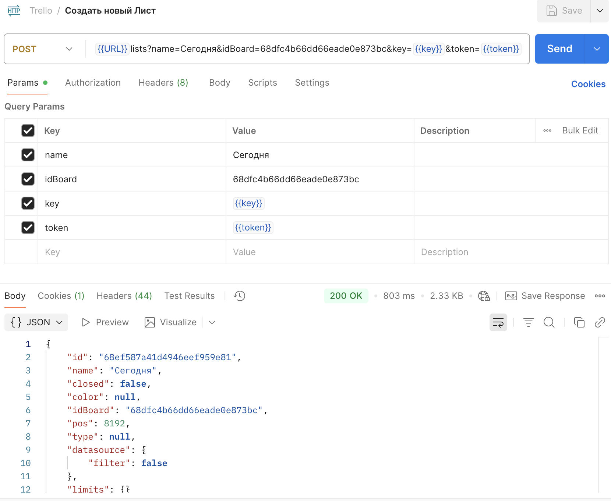
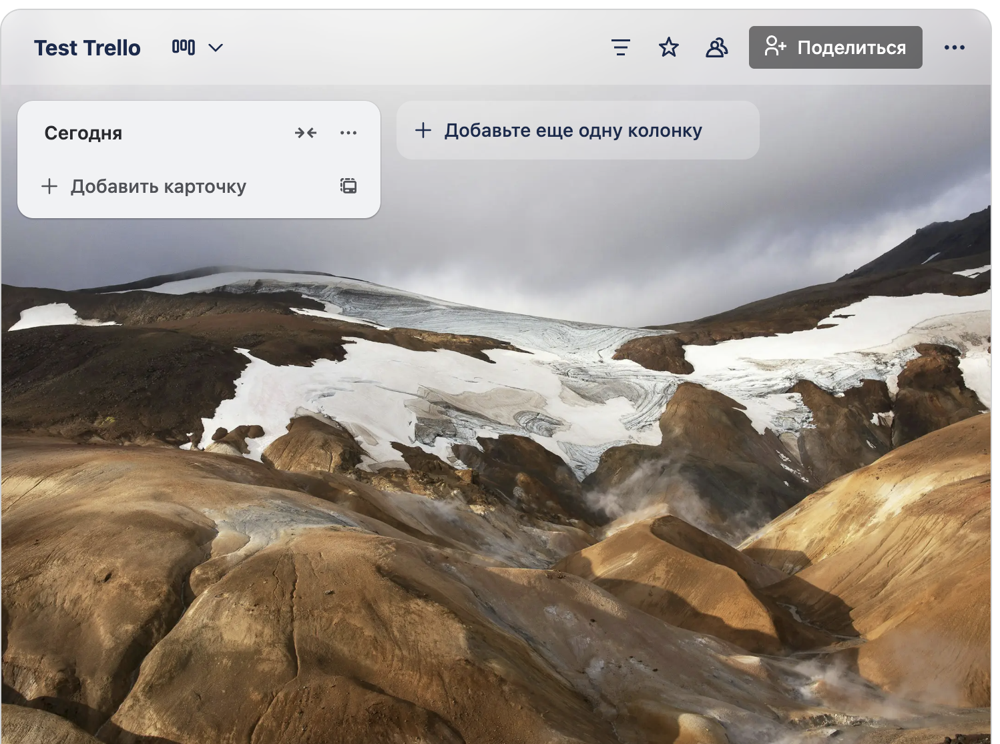
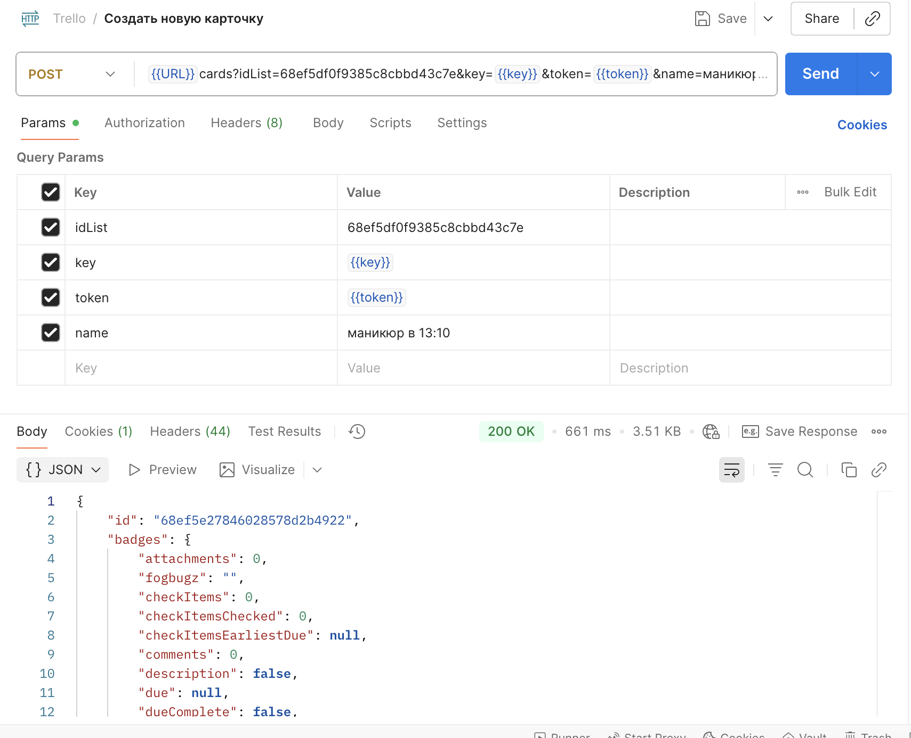
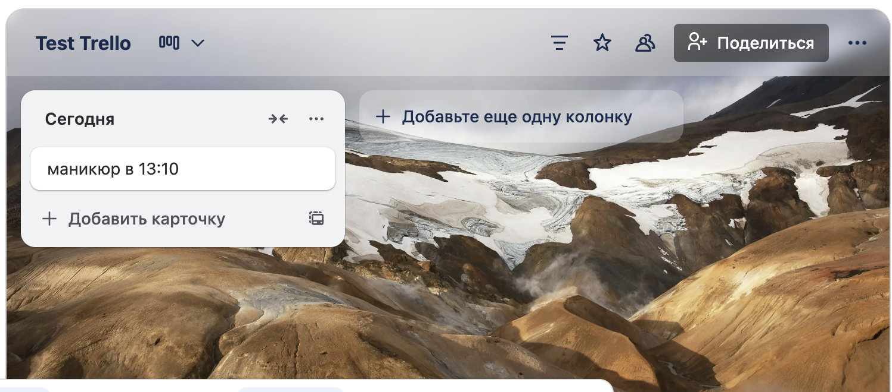
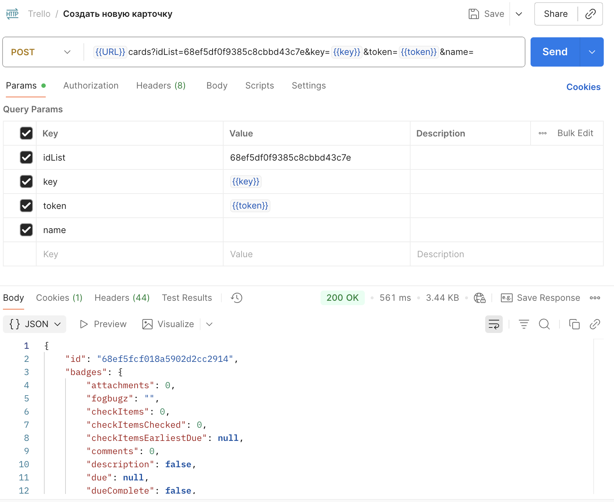
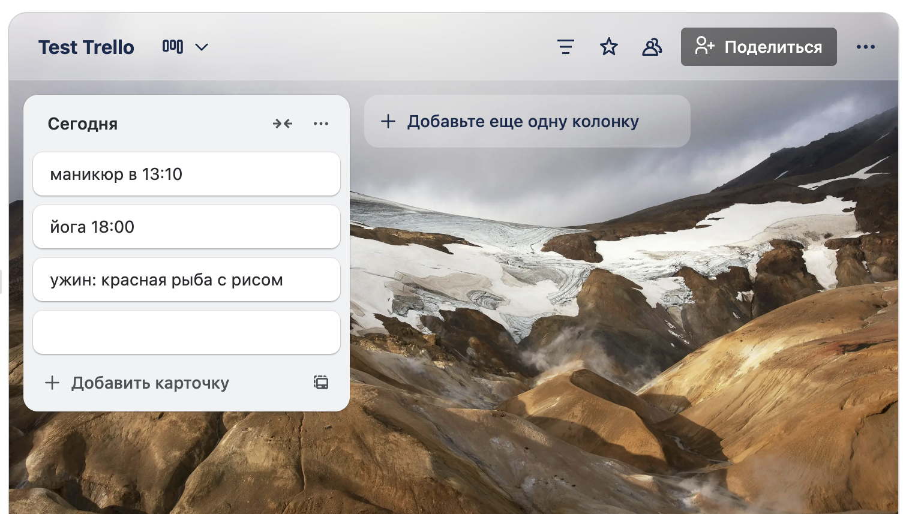

# Проверка работы Trello API: опыт тестирования в Postman
## Введение
В процессе тестирования веб-приложений особое внимание уделяется проверке работы API, поскольку именно через него осуществляется взаимодействие между клиентом и сервером. Одним из популярных инструментов для тестирования API является Postman, который позволяет выполнять запросы, анализировать ответы и выявлять ошибки на уровне взаимодействия сервисов.

### Цель тестирования API веб-приложения Trello
- убедиться, что основные функции сервиса корректно обрабатываются на уровне API. Проверка проводилась для оценки стабильности, правильности ответов сервера и соответствия документации.
- проверка основных блоков:
* "Cards" (https://developer.atlassian.com/cloud/trello/rest/api-group-cards/#api-group-cards)
* "Lists" (https://developer.atlassian.com/cloud/trello/rest/api-group-lists/#api-lists-post)

### Инструменты и окружение
- Инструмент тестирования: Postman
- Среда: MacOS Tahoe 26.0.1
- API: Trello REST API
- Методы тестирования: ручное тестирование API
- Типы запросов: GET, POST, PUT, DELETE

1. ### Создать новый список (лист) через Postman

Проверяем корректность отображения в веб-риложении
Все верно, список задач "Сегодня" успешно создан.

**!!! Также необходимо протестировать все остальные методы API, чтобы убедиться, что система корректно обрабатывает ошибки и отображает соответствующие сообщения об ошибках при некорректных запросах.**

### 2. Создать несколько карточек в созданном списке (листе) через Postman

Проверяем корректность отображения в веб-риложении
Все верно, карточка успешно создана, отображается корректно

По такому же принципу создадим еще несколько карточек

А что если мы оставим поле "name" пустым и создадим карточку?
Ага... пустая карточка успешно создана через API, чего быть не должно!

Проверяем, что пустая карточка также отображается в интерфейсе веб-приложения

Проверяем, можно ли создать пустую карточку через интерфейс веб-приложения? 

Нет, данное действие невозможно. Должен быть написан хотя бы 1 символ в карточке для успешного создания.

## Найден БАГ
Давайте его сразу зафиксируем в баг-репорт!

## Баг-репорт

