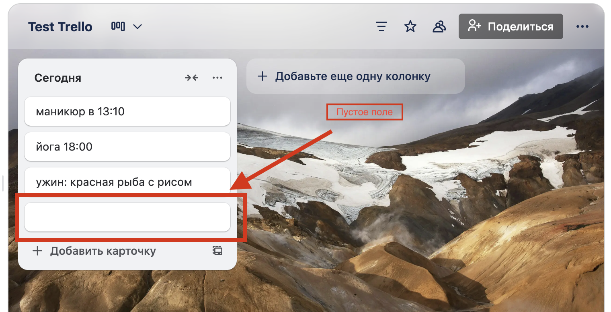

# Проверка работы Trello API: опыт тестирования в Postman
## Введение
В процессе тестирования веб-приложений особое внимание уделяется проверке работы API, поскольку именно через него осуществляется взаимодействие между клиентом и сервером. Одним из популярных инструментов для тестирования API является Postman, который позволяет выполнять запросы, анализировать ответы и выявлять ошибки на уровне взаимодействия сервисов.

### Цель тестирования API веб-приложения Trello
- убедиться, что основные функции сервиса корректно обрабатываются на уровне API. Проверка проводилась для оценки стабильности, правильности ответов сервера и соответствия документации.
- проверка основных блоков:
* "Cards" (https://developer.atlassian.com/cloud/trello/rest/api-group-cards/#api-group-cards)
* "Lists" (https://developer.atlassian.com/cloud/trello/rest/api-group-lists/#api-lists-post)

### Инструменты и окружение
- Инструмент тестирования: Postman
- Среда: MacOS Tahoe 26.0.1
- API: Trello REST API
- Методы тестирования: ручное тестирование API
- Типы запросов: GET, POST, PUT, DELETE

1. ### Создать новый список (лист) через Postman

Проверяем корректность отображения в веб-риложении
Все верно, список задач "Сегодня" успешно создан.

**!!! Также необходимо протестировать все остальные методы API, чтобы убедиться, что система корректно обрабатывает ошибки и отображает соответствующие сообщения об ошибках при некорректных запросах.**

### 2. Создать несколько карточек в созданном списке (листе) через Postman

Проверяем корректность отображения в веб-риложении
Все верно, карточка успешно создана, отображается корректно

По такому же принципу создадим еще несколько карточек

А что если мы оставим поле "name" пустым и создадим карточку?
Ага... пустая карточка успешно создана через API, чего быть не должно!

Проверяем, что пустая карточка также отображается в интерфейсе веб-приложения

Проверяем, можно ли создать пустую карточку через интерфейс веб-приложения? 

Нет, данное действие невозможно. Должен быть написан хотя бы 1 символ в карточке для успешного создания.

## Найден БАГ
Давайте его сразу зафиксируем в баг-репорт!

## Баг-репорт
№ BUG-TR-1

**Название:** возможность создавать пустые карточки через API

**Приоритет:** Medium
**Cерьезность:** Minor

**Описание:** через API можно создавать и оставлять карточки без названия, тогда как в веб-интерфейсе это действие невозможно (система требует обязательное заполнение названия при создании).

**Шаги воспроизведения:**

**Через API (возможно):**
1.	Вызвать метод создания карточки: POST / Создать новую карточку
2.	В Query Params передать: {"name": "  "}
3. Нажать "Send" 
4. Карточка успешно создана без названия

**Фактичекий результат:** 
1. JSON возвращает 200 ОК
2. Создана карточка с пустым названием. Пустая карточка отображается в интерфейсе веб-приложения.

**Ожидаемый результат:**
1. JSON возвращает 400
2. Создать карточку с пустым полем невозможно. 

**Через UI (невозможно)**
1. Открыть доску Trello
2. Нажать "Добавить карточку"
3. Оставить поле названия пустым
4. Попытаться сохранить

**Ожидаемый результат:**
1. Сохранить карточку невозможно

**Фактичекий результат:**
1. сохранить карточку невозможно

**Комментарий:**
* UI: блокирует создание карточки без названия
* Если в UI нельзя создавать пустые карточки, то и API должен возвращать ошибку при попытке создания карточки с пустым названием

**Окружение:**
•	API Version: Trello API v1, Postman
•	Веб-приложение: Trello Web
•	Окружение: MacOS, Yandex (25.8.0.1963 (64-bit))
•	Дата тестирования: 15.10.2025

**Приложения** 
Скриншоты

Тестирование через API 

Отображение в UI

**Предложение по исправлению:**
Добавить валидацию в API метод POST /cards - запрещать создание карточек с пустым названием, возвращать 400 Bad Request с сообщением "Card name cannot be empty"

